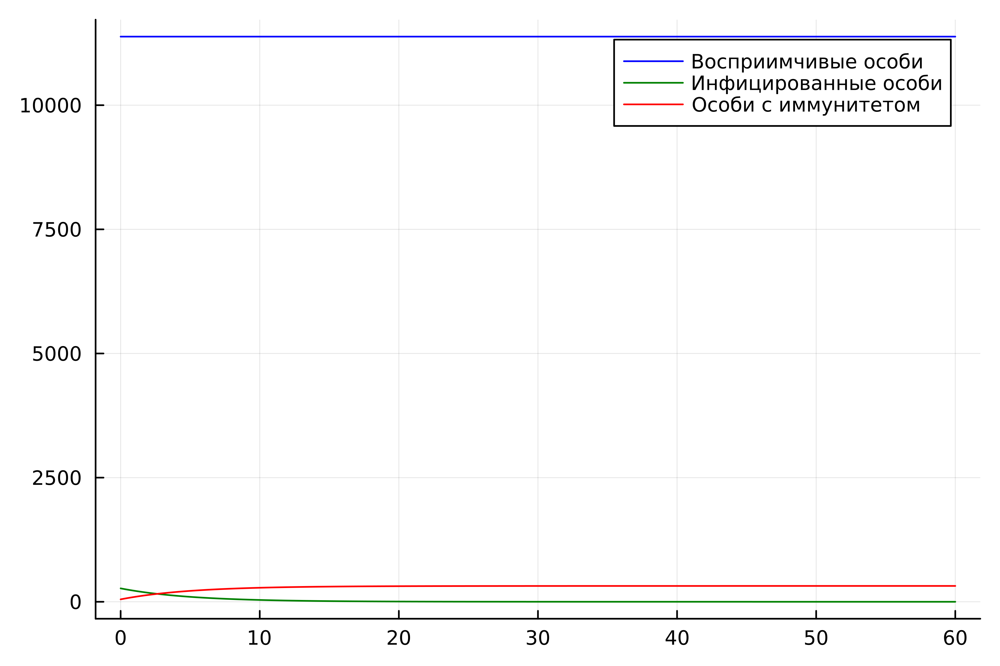
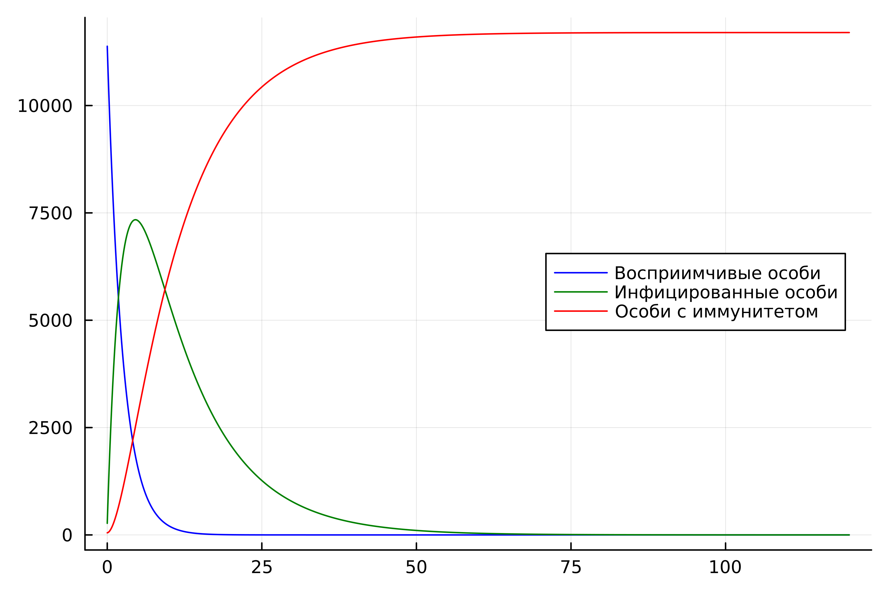
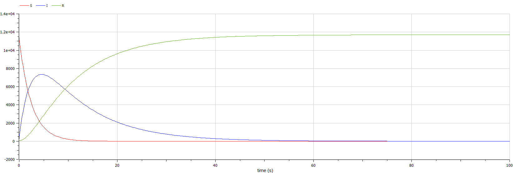

---
## Front matter
lang: ru-RU
title: "Защита лабораторной работы №6

Модель эпидемии"
subtitle: Математическое моделирование
author:
  - Фаик Карим Яссерович
institute:
  - Российский университет дружбы народов, Москва, Россия
date: 2023

## i18n babel
babel-lang: russian
babel-otherlangs: english

## Formatting pdf
toc: false
toc-title: Содержание
slide_level: 2
aspectratio: 169
section-titles: true
theme: metropolis
header-includes:
 - \metroset{progressbar=frametitle,sectionpage=progressbar,numbering=fraction}
 - '\makeatletter'
 - '\beamer@ignorenonframefalse'
 - '\makeatother'
---

## Докладчик

:::::::::::::: {.columns align=center}
::: {.column width="70%"}

  * Малашенко Марина Владимировна
  * Студентка группы НФИбд-01-20
  * Студ. билет 1032202459
  * Российский университет дружбы народов

:::
::: {.column width="30%"}

:::
::::::::::::::

## Цель лабораторной работы

- Изучить и построить модель эпидемии

## Теоретическое введние. Построение математической модели (1)

Рассмотрим простейшую модель эпидемии. Предположим, что некая популяция, состоящая из $N$ особей, (считаем, что популяция изолирована) подразделяется на три группы. Первая группа - это восприимчивые к болезни, но пока здоровые особи, обозначим их через $S(t)$. Вторая группа – это число инфицированных особей, которые также при этом являются распространителями инфекции, обозначим их $I(t)$. А третья группа, обозначающаяся через $R(t)$ – это здоровые особи с иммунитетом к болезни. 

До того, как число заболевших не превышает критического значения $I^*$, считаем, что все больные изолированы и не заражают здоровых. Когда $I(t)> I^*$, тогда инфицирование способны заражать восприимчивых к болезни особей. 

## Теоретическое введние. Построение математической модели (2)

Таким образом, скорость изменения числа $S(t)$ меняется по следующему закону:

$$
\frac{dS}{dt}=
 \begin{cases}
	-\alpha S &\text{, если $I(t) > I^*$}
	\\   
	0 &\text{, если $I(t) \leq I^*$}
 \end{cases}
$$

## Теоретическое введние. Построение математической модели (3)

Поскольку каждая восприимчивая к болезни особь, которая, в конце концов, заболевает, сама становится инфекционной, то скорость изменения числа инфекционных особей представляет разность за единицу времени между заразившимися и теми, кто уже болеет и лечится, то есть:

$$
\frac{dI}{dt}=
 \begin{cases}
	\alpha S -\beta I &\text{,если $I(t) > I^*$}
	\\   
	-\beta I &\text{,если $I(t) \leq I^*$}
 \end{cases}
$$

## Теоретическое введние. Построение математической модели (4)

А скорость изменения выздоравливающих особей (при этом приобретающие иммунитет к болезни):

$$\frac{dR}{dt} = \beta I$$

Постоянные пропорциональности $\alpha, \beta$ - это коэффициенты заболеваемости и выздоровления соответственно. Для того, чтобы решения соответствующих уравнений определялось однозначно, необходимо задать начальные условия. Считаем, что на начало эпидемии в момент времени $t=0$ нет особей с иммунитетом к болезни $R(0)=0$, а число инфицированных и восприимчивых к болезни особей $I(0)$ и $S(0)$ соответственно. Для анализа картины протекания эпидемии необходимо рассмотреть два случая:  $I(0) \leq I^*$ и  $I(0)>I^*$

## Задание лабораторной работы. Вариант 30

На одном острове вспыхнула эпидемия. Известно, что из всех проживающих на острове 
$(N=11700)$ в момент начала эпидемии $(t=0)$ число заболевших людей 
(являющихся распространителями инфекции) $I(0)=270$, А число здоровых людей с иммунитетом 
к болезни $R(0)=49$. Таким образом, число людей восприимчивых к болезни, 
но пока здоровых, в начальный момент времени $S(0)=N-I(0)-R(0)$.
Постройте графики изменения числа особей в каждой из трех групп.

Рассмотрите, как будет протекать эпидемия в случае:

1.	$I(0)\leq I^*$

2.	$I(0)>I^*$

## Задачи:

Построить графики изменения числа особей в каждой из трех групп $S$, $I$, $R$. Рассмотреть, как будет протекать эпидемия в случаях:

1.	$I(0)\leq I^*$

2.	$I(0)>I^*$

# Ход выполнения лабораторной работы

## Математическая модель

По представленному выше теоретическому материалу были составлены модели на обоих языках программирования.

# Решение с помощью программ

## Результаты работы кода на Julia и Open Modelica для случая $I(0) \leq I^*$ 
(графики численности особей трех групп $S$, $I$, $R$, когда больные изолированы)

:::::::::::::: {.columns align=center}
::: {.column width="50%"}

{#fig:001}

::: 
::: {.column width="50%"}

{#fig:003}

:::
::::::::::::::

## Результаты работы кода на Julia и Open Modelica для случая $I(0) \leq I^*$ 
(графики численности особей трех групп $S$, $I$, $R$, когда больные могут заражать особей группы $S$)

:::::::::::::: {.columns align=center}
::: {.column width="50%"}

{#fig:002}

::: 
::: {.column width="50%"}

{#fig:004}

:::
::::::::::::::

## Анализ полученных результатов. Сравнение языков.

- В итоге проделанной работы мы построили графики зависимости численности особей трех групп S, I, R для случаев, когда больные изолированы и когда они могут заражать особей группы S.

- Построение модели эпидемии на языке OpenModelica занимает значительно меньше строк, чем аналогичное построение на Julia. Кроме того, построения на языке OpenModelica проводятся относительно значения времени t по умолчанию, что упрощает нашу работу.

# Вывод

## Вывод

В ходе выполнения лабораторной работы была изучена модель эпидемии и построена модель на языках Julia и Open Modelica.

## Список литературы. Библиография

 [1] Документация по Julia: https://docs.julialang.org/en/v1/

 [2] Документация по OpenModelica: https://openmodelica.org/

 [3] Решение дифференциальных уравнений: https://www.wolframalpha.com/

 [4] Конструирование эпидемиологических моделей: https://habr.com/ru/post/551682/