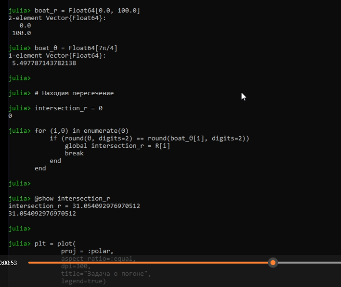
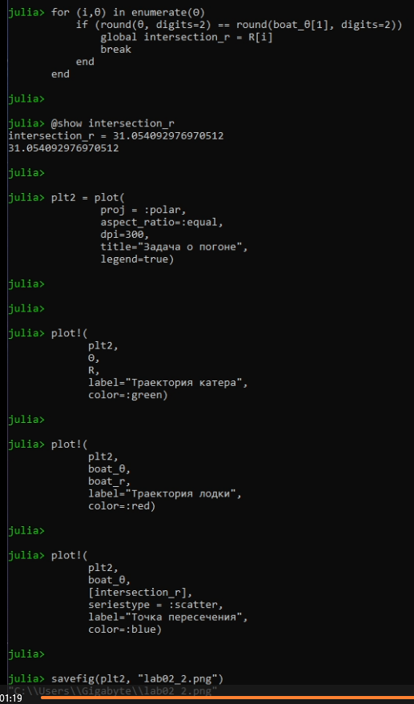
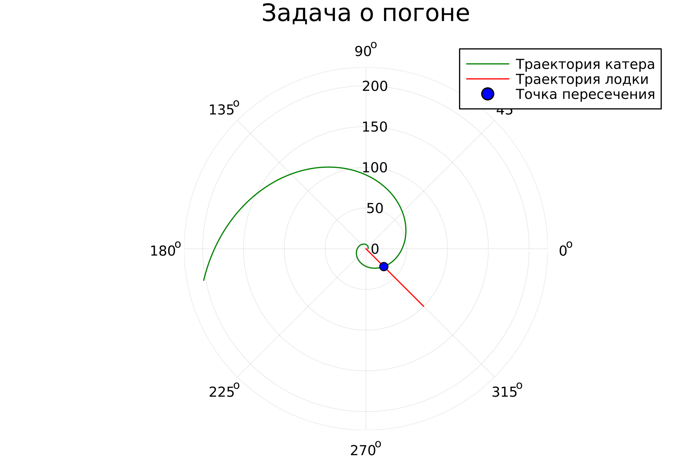
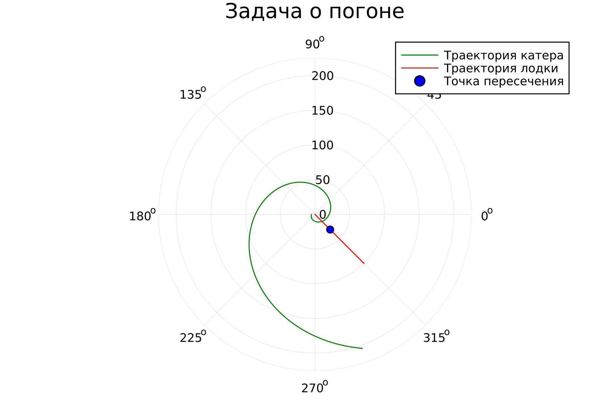

---
# Front matter
lang: ru-RU
title: "Лабораторная работа 2"
subtitle: "Задача о погоне"
author: "Фаик Карим"

# Formatting
toc-title: "Содержание"
toc: true # Table of contents
toc_depth: 2
fontsize: 12pt
linestretch: 1.5
papersize: a4paper
documentclass: scrreprt
polyglossia-lang: russian
polyglossia-otherlangs: english
mainfont: PT Serif
romanfont: PT Serif
sansfont: PT Sans
monofont: PT Mono
mainfontoptions: Ligatures=TeX
romanfontoptions: Ligatures=TeX
sansfontoptions: Ligatures=TeX,Scale=MatchLowercase
monofontoptions: Scale=MatchLowercase
indent: true
pdf-engine: latex
header-includes:
  - \linepenalty=10 # the penalty added to the badness of each line within a paragraph (no associated penalty node) Increasing the value makes tex try to have fewer lines in the paragraph.
  - \interlinepenalty=0 # value of the penalty (node) added after each line of a paragraph.
  - \hyphenpenalty=50 # the penalty for line breaking at an automatically inserted hyphen
  - \exhyphenpenalty=50 # the penalty for line breaking at an explicit hyphen
  - \binoppenalty=700 # the penalty for breaking a line at a binary operator
  - \relpenalty=500 # the penalty for breaking a line at a relation
  - \clubpenalty=150 # extra penalty for breaking after first line of a paragraph
  - \widowpenalty=150 # extra penalty for breaking before last line of a paragraph
  - \displaywidowpenalty=50 # extra penalty for breaking before last line before a display math
  - \brokenpenalty=100 # extra penalty for page breaking after a hyphenated line
  - \predisplaypenalty=10000 # penalty for breaking before a display
  - \postdisplaypenalty=0 # penalty for breaking after a display
  - \floatingpenalty = 20000 # penalty for splitting an insertion (can only be split footnote in standard LaTeX)
  - \raggedbottom # or \flushbottom
  - \usepackage{float} # keep figures where there are in the text
  - \floatplacement{figure}{H} # keep figures where there are in the text
---


# Цель работы

Решить задачу о погоне, на примере лодками с браконьером и береговой охраной.


# Задание

1. Провести аналогичные рассуждения и вывод дифференциальных уравнений, если скорость катера больше скорости лодки в n раз (значение n задайте самостоятельно)
2. Построить траекторию движения катера и лодки для двух случаев. (Задайте самостоятельно начальные значения)
3. Определить по графику точку пересечения катера и лодки.\


# Выполнение лабораторной работы

1. Зададим начальные условия (вариант 62)
$$ k = 14.4; n = 4.7; t_{0}=0; t_{L0}=0; t_{K0}=18.1 $$
2. Будем вести отсчет в полярных координатах. Полюс у нас это место обнаружения браконьеров.
3. Чтобы найти расстояние x(расстояние после которого катер начнет двигаться вокруг полюса), необходимо составить простое уравнение. Пусть через время $t$ катер и лодка окажутся на одном расстоянии $x$ от полюса. За это время лодка пройдет $x$, а катер $k-x$ (или $k+x$, в зависимости от начального положения катера относительно полюса). Время, за которое они пройдут это расстояние, вычисляется как $x/v$ или $(k-x) / 4.7v$ (во втором случае $(k+x) / 4.7v$). Так как время одно и то же, то эти величины одинаковы. Составим уравнения и найдем растояние $x$ (@fig:001)

{#fig:001 width=50%}

{#fig:002 width=50%}

4. После того, как катер береговой охраны окажется на одном расстоянии от полюса, что и лодка, он должен сменить прямолинейную траекторию и начать двигаться вокруг полюса удаляясь от него со скоростью лодки v.
Для этого скорость катера раскладываем на радиальную [@rad:math] и тангенциальную [@tan:math] скорости
$$v_r = \frac{\mathrm{d} r}{\mathrm{d} t}$$ 
$$v_\tau = r\frac{\mathrm{d} \theta}{\mathrm{d} t} = v\sqrt{19.25}$$
5. Давайте просчитаем траекторию движения браконьеров и движения лодки охраны и найдем точки пересечения при помощи следующего кода

# Код
```julia

using Plots
using DifferentialEquations

function F(du,u,p,t)
	r, θ = u
	du[1] = 2
	du[2] = sqrt(19.25) / u[1]
end

r₀ = 14.4/5.7
h = 0.1
θ₀ = 0.0
tspan = (0, 100)
prob = ODEProblem(F, [r₀, θ₀], tspan)
sol = solve(prob, dtmax=h)

#Достаем значения
R = [u[1] for u in sol.u]
Θ = [u[2] for u in sol.u]

boat_r = Float64[0.0, 100.0]
boat_θ = Float64[7π/4]

# Находим пересечение
intersection_r = 0
for (i,θ) in enumerate(Θ)
	if (round(θ, digits=2) == round(boat_θ[1], digits=2))
		global intersection_r = R[i]
		break
	end
end

@show intersection_r

plt = plot(
	   proj = :polar,
	   aspect_ratio=:equal,
	   dpi=300,
	   title="Задача о погоне",
	   legend=true)

plot!(
      plt,
      Θ,
      R,
      label="Траектория катера",
      color=:green)

plot!(
      plt,
      boat_θ,
      boat_r,
      label="Траектория лодки",
      color=:red)

plot!(
      plt,
      boat_θ,
      [intersection_r],
      seriestype = :scatter,
      label="Точка пересечения",
      color=:blue)

savefig(plt, "lab02_1.png")


r₀ = 18.1/3.7
θ₀ = π

prob = ODEProblem(F, [r₀, θ₀], tspan)
sol = solve(prob, dtmax=h)

#Достаем значения
R = [u[1] for u in sol.u]
Θ = [u[2] for u in sol.u]

boat_r = Float64[0.0, 100.0]

# Находим пересечение
for (i,θ) in enumerate(Θ)
	if (round(θ, digits=2) == round(boat_θ[1], digits=2))
		global intersection_r = R[i]
		break
	end
end

@show intersection_r

plt2 = plot(
	    proj = :polar,
	    aspect_ratio=:equal,
	    dpi=300,
	    title="Задача о погоне",
	    legend=true)


plot!(
      plt2,
      Θ,
      R,
      label="Траектория катера",
      color=:green)

plot!(
      plt2,
      boat_θ,
      boat_r,
      label="Траектория лодки",
      color=:red)

plot!(
      plt2,
      boat_θ,
      [intersection_r],
      seriestype = :scatter,
      label="Точка пересечения",
      color=:blue)

savefig(plt2, "lab02_2.png")

6. Далее получим следующие траектории движения


{#fig:003 width=50%}

{#fig:004 width=50%}


# Выводы

По мере выполнения данной работы я научился работать с языком Julia посредством решения задачи о погоне на примере лодки с браконьерами и береговой охраны