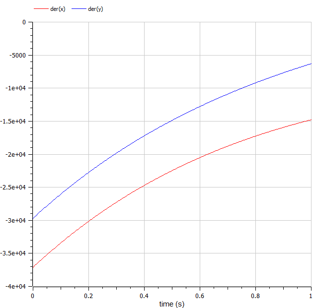

---
# Front matter
lang: ru-RU
title: "Лабораторная работа №3"
subtitle: "Модель боевых действий"
author: "Фаик Карим"

# Formatting
toc-title: "Содержание"
toc: true # Table of contents
toc_depth: 2
fontsize: 12pt
linestretch: 1.5
papersize: a4paper
documentclass: scrreprt
polyglossia-lang: russian
polyglossia-otherlangs: english
mainfont: PT Serif
romanfont: PT Serif
sansfont: PT Sans
monofont: PT Mono
mainfontoptions: Ligatures=TeX
romanfontoptions: Ligatures=TeX
sansfontoptions: Ligatures=TeX,Scale=MatchLowercase
monofontoptions: Scale=MatchLowercase
indent: true
pdf-engine: lualatex
header-includes:
  - \linepenalty=10 # the penalty added to the badness of each line within a paragraph (no associated penalty node) Increasing the value makes tex try to have fewer lines in the paragraph.
  - \interlinepenalty=0 # value of the penalty (node) added after each line of a paragraph.
  - \hyphenpenalty=50 # the penalty for line breaking at an automatically inserted hyphen
  - \exhyphenpenalty=50 # the penalty for line breaking at an explicit hyphen
  - \binoppenalty=700 # the penalty for breaking a line at a binary operator
  - \relpenalty=500 # the penalty for breaking a line at a relation
  - \clubpenalty=150 # extra penalty for breaking after first line of a paragraph
  - \widowpenalty=150 # extra penalty for breaking before last line of a paragraph
  - \displaywidowpenalty=50 # extra penalty for breaking before last line before a display math
  - \brokenpenalty=100 # extra penalty for page breaking after a hyphenated line
  - \predisplaypenalty=10000 # penalty for breaking before a display
  - \postdisplaypenalty=0 # penalty for breaking after a display
  - \floatingpenalty = 20000 # penalty for splitting an insertion (can only be split footnote in standard LaTeX)
  - \raggedbottom # or \flushbottom
  - \usepackage{float} # keep figures where there are in the text
  - \floatplacement{figure}{H} # keep figures where there are in the text
---


# Цель работы

Изучить модели боевых действий Ланчестера. Применить их на практике для решения задания лабораторной работы. 

# Задание
Между страной Х и страной У идет война. Численность состава войск исчисляется от начала войны, и являются временными функциями $x(t)$ и $y(t)$. В
начальный момент времени страна Х имеет армию численностью $22022$ человек, а в распоряжении страны У армия численностью в $33033$ человек. Для упрощения модели считаем, что коэффициенты $a$, $b$, $c$, $h$ постоянны. Также считаем $P(t)$ и $Q(t)$ непрерывными функциями. 

Постройте графики изменения численности войск армии Х и армии У для следующих случаев:

1. Модель боевых действий между регулярными войсками:

$$ {dx\over {dt}} = -0.36x(t)-0.48y(t)+sin(t+1)+1 $$
$$ {dy\over {dt}} = -0.49x(t)-0.37y(t)+cos(t+2)+1.1 $$

2. Модель ведение боевых действий с участием регулярных войск и партизанских отрядов:

$$ {dx\over {dt}} = -0.11x(t)-0.68y(t)+sin(5t) $$
$$ {dy\over {dt}} = -0.6x(t)y(t)-0.15y(t)+cos(5t) + 1 $$


# Выполнение лабораторной работы

## Математическая модель

### Регулярная армия X против регулярной армии Y
Рассмотрим первый случай. 
Численность регулярных войск определяется тремя факторами:

1. Cкорость уменьшения численности войск из-за причин, не связанных с боевыми действиями (болезни, травмы, дезертирство);
2. Cкорость потерь, обусловленных боевыми действиями противоборствующих сторон (что связанно с качеством стратегии, уровнем вооружения, профессионализмом солдат и т.п.);
3. Cкорость поступления подкрепления (задаётся некоторой функцией от времени).

В этом случае модель боевых действий между регулярными войсками описывается следующим образом:

$$ {dx\over {dt}} = -a(t)x(t)-b(t)y(t)+P(t) $$
$$ {dy\over {dt}} = -c(t)x(t)-h(t)y(t)+Q(t) $$

В первом пункте нами рассматривается как раз такая модель. Она является доработанной моделью Ланчестера, так его изначальная модель учитывала лишь члены $b(t)y(t)$ и $c(t)x(t)$, то есть, на потери за промежуток времени влияли лишь численность армий и "эффективность оружия" (коэффициенты $b(t)$ и $c(t)$).

$$ {dx\over {dt}} = -ax(t)-by(t)+P(t) $$
$$ {dy\over {dt}} = -cx(t)-hy(t)+Q(t) $$

Именно эти уравнения [3] и будут решать наши программы для выполнения первой части задания. В конце мы получим график кривой в декартовых координатах, где по оси $ox$ будет отображаться численность армии государства X, по оси $oy$ будет отображаться соответствующая численность армии Y. По тому, с какой осью пересечётся график, можно определить исход войны. Если ось $ox$ будет пересечена в положительных значениях, победа будет на стороне армии государства X (так как при таком раскладе численность армии Y достигла нуля при положительном значении численности армии X). Аналогичная ситуация для оси $oy$ и победы армии государства Y. 

### Регулярная армия X против партизанской армии Y

Для второй части задания, то есть, для моделирования боевых действий между регулярной армией и партизанской армией, необходимо внести поправки в предыдущую модель. Считается, что темп потерь партизан, проводящих свои операции в разных местах на некоторой известной территории, пропорционален не только численности армейских соединений, но и численности самих партизан.

$$ {dx\over {dt}} = -a(t)x(t)-b(t)y(t)+P(t) $$
$$ {dy\over {dt}} = -c(t)x(t)y(t)-h(t)y(t)+Q(t) $$

Коэффициенты $a$, $b$, $c$ и $h$ всё так же будут положительными десятичными числами:

$$ {dx\over {dt}} = -ax(t)-by(t)+P(t) $$
$$ {dy\over {dt}} = -cx(t)y(t)-hy(t)+Q(t) $$

# Код
```julia

using Plots;
using DifferentialEquations;

function one(du, u, p, t)
    du[1] = - -0.401*u[1] - 0.707*u[2] + sin(8*t)
    du[2] = - 0.606*u[1] - 0.502*u[2] + cos(6*t)
end

function two(du, u, p, t)
    du[1] = - 0.343*u[1] - 0.895*u[2] + 2*sin(2*t)
    du[2] = - 0.699*u[1] - 0.502*u[2] + 2*cos(t)
end

const people = Float64[22022, 33033]
const prom1 = [0.0, 3.0]
const prom2 = [0.0, 0.0007]

prob1 = ODEProblem(one, people, prom1)
prob2 = ODEProblem(two, people, prom2)

sol1 = solve(prob1, dtmax=0.1)
sol2 = solve(prob2, dtmax=0.000001)

A1 = [u[1] for u in sol1.u]
A2 = [u[2] for u in sol1.u]
T1 = [t for t in sol1.t]
A3 = [u[1] for u in sol2.u]
A4 = [u[2] for u in sol2.u]
T2 = [t for t in sol2.t]

plt1 = plot(dpi = 300, legend= true, bg =:white)
plot!(plt1, xlabel="Время", ylabel="Численность", title="Модель боевых действий - случай 1", legend=:outerbottom)
plot!(plt1, T1, A1, label="Численность армии X", color =:red)
plot!(plt1, T1, A2, label="Численность армии Y", color =:green)
savefig(plt1, "lab03_1.png")

plt2 = plot(dpi = 1200, legend= true, bg =:white)
plot!(plt2, xlabel="Время", ylabel="Численность", title="Модель боевых действий - случай 2", legend=:outerbottom)
plot!(plt2, T2, A3, label="Численность армии X", color =:red)
plot!(plt2, T2, A4, label="Численность армии Y", color =:green)
savefig(plt2, "lab03_2.png")

```
### Результаты работы кода на Julia

{#fig:001}

{#fig:002}


На рис. @fig:001 и @fig:002 изображены итоговые графики для обоих случаев.


## OpenModelica

### Программный код решения на OpenModelica [2]

```OpenModelica
model Lab03_01
Real x;
Real y;
Real a = 0.401;
Real b = 0.707;
Real c = 0.606;
Real d = 0.502;
Real t = time;
initial equation
x = 22022;
y = 33033;
equation
der(x) = -a*x - b*y + sin(8*t);
der(y) = -c*x*y - d*y + cos(6*t);
end Lab03_01;


model Lab03_02
Real x;
Real y;
Real a = 0.343;
Real b = 0.895;
Real c = 0.699;
Real d = 0.433;
Real t = time;
initial equation
x = 22022;
y = 33033;
equation
der(x) = -a*x - b*y + 2*sin(2*t);
der(y) = -c*x - d*y + 2*cos(t);
end Lab03_02;

```

### Результаты работы кода на OpenModelica

На графиках на рис. @fig:003 и @fig:004, построенных с помощью OpenModelica изображены графики, аналогичные графикам @fig:001 и @fig:002 соответственно.

{#fig:003}

{#fig:004}


# Анализ полученных результатов. Сравнение языков.

Как видно из графиков, для первой модели, то есть двух регулярных армий, противостоящих друг другу, графики на Julia и OpenModelica идентичны (с поправкой на использование разных графических ресурсов, разный масштаб и т.д.).

Аналогичная ситуация верна и для графиков противостояния регулярной армии армии партизанов, которые рассматривались во второй модели.

# Вывод

По итогам лабораторной работы я построила по две модели на языках Julia и OpenModelica. В ходе проделанной работы можно сделать вывод, что OpenModelica лучше приспособлен для моделирование процессов, протекающих во времени. Построение моделей боевых действий на языке OpenModelica занимает гораздо меньше строк и времени, чем аналогичное построение на языке Julia.